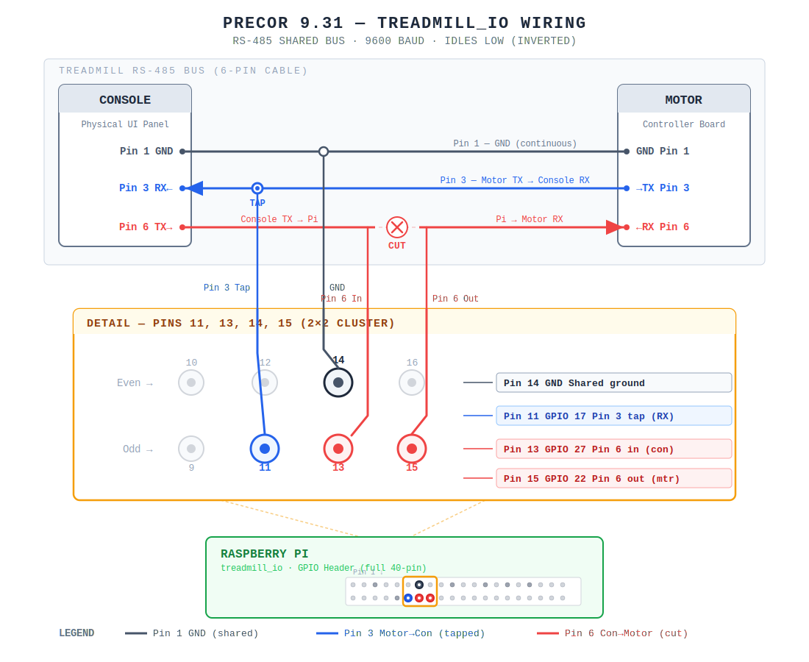

# Hardware Reverse Engineering

[Back to README](README.md)

This document covers the physical hardware, serial protocol, and wiring for the Precor 9.3x treadmill. If you're here, you're probably interested in how a ~2005 treadmill talks to itself over an RJ45 cable.

---

## The Hardware

### Two Computers, One Cable

The treadmill has two independent circuit boards:

- **Console (Upper PCA)** — the display and buttons. It decides what speed and incline to request.
- **Motor controller (Lower PCA)** — drives the belt motor and lift motor. It reports back sensor readings.

They talk over a single RJ45 cable (the same connector as an Ethernet cable, but this is not Ethernet).

### Cable Pinout

| Pin | Function | Notes |
|-----|----------|-------|
| 1 | Ground | |
| 2 | VCC (~8V) | Power from motor controller to console |
| 3 | Motor → Console | 3.3V serial, RS-485 inverted polarity |
| 4 | Unknown | Possibly clock — unconfirmed |
| 5 | Safety interlock | Connected to the safety strap magnet; open circuit = motor stops |
| 6 | Console → Motor | 3.3V serial, RS-485 inverted polarity |
| 7 | Ground | |
| 8 | VCC (~8V) | |

Pins 3 and 6 are the interesting ones — they carry the serial protocol.

### The Protocol

Both directions use 9600 baud, 8N1 serial. Messages are plain ASCII text wrapped in square brackets.

#### Wire Format

Every message is a bracket-delimited key-value pair. On the wire, each byte is standard ASCII:

```
Set command:   [  k  e  y  :  v  a  l  u  e  ]  0xFF
               5B 6B 65 79 3A 76 61 6C 75 65 5D FF

Query command: [  k  e  y  ]  0xFF
               5B 6B 65 79 5D FF
```

A **set command** has a colon between key and value: `[inc:A]`. A **query** has no colon, just the key: `[amps]`. The `0xFF` byte terminates each message on pin 6 (console → motor). Pin 3 (motor → console) uses the same bracket format but omits the `0xFF`.

#### Console → Motor (pin 6)

The console sends a repeating cycle of 14 keys, grouped into 5 bursts with ~100ms pauses between them. Here's one full cycle as it appears on the wire, at 2.5 mph and 5% incline:

```
Burst 1:  [inc:A] FF  [hmph:FA] FF              ← incline + speed
          ~100ms pause
Burst 2:  [amps] FF  [err] FF  [belt] FF        ← sensor queries
          ~100ms pause
Burst 3:  [vbus] FF  [lift] FF  [lfts] FF  [lftg] FF
          ~100ms pause
Burst 4:  [part:6] FF  [ver] FF  [type] FF      ← identity queries
          ~100ms pause
Burst 5:  [diag:0] FF  [loop:5550] FF           ← diagnostics
```

Then the whole cycle repeats. The console sends this continuously, roughly once per second.

Four keys always carry a fixed value (`inc`, `hmph`, `part`, `diag`, `loop`). The rest are bare queries — the console is asking the motor to report back.

#### Motor → Console (pin 3)

The motor responds to queries with the same bracket format, no `0xFF`:

```
[belt:14] [inc:0] [hmph:69] [amps:FF] [ver:19A] [lift:28] [type:20]
```

Responses arrive interleaved with the console's bursts.

#### Speed and Incline Encoding

The `hmph` key encodes speed as **mph × 100, in uppercase hex**:

| mph | × 100 | Hex | Wire bytes |
|-----|--------|-----|------------|
| 0 (stopped) | 0 | `0` | `[hmph:0]` → `5B 68 6D 70 68 3A 30 5D FF` |
| 1.2 | 120 | `78` | `[hmph:78]` → `5B 68 6D 70 68 3A 37 38 5D FF` |
| 2.5 | 250 | `FA` | `[hmph:FA]` → `5B 68 6D 70 68 3A 46 41 5D FF` |
| 6.0 | 600 | `258` | `[hmph:258]` → `5B 68 6D 70 68 3A 32 35 38 5D FF` |

The `inc` key encodes incline as **half-percent units in uppercase hex**. The incline percentage is multiplied by 2, then converted to hex. Because the unit is half-percent, odd hex values represent 0.5% increments:

| Incline | Half-pct | Hex | Wire bytes |
|---------|----------|-----|------------|
| 0% | 0 | `0` | `[inc:0]` → `5B 69 6E 63 3A 30 5D FF` |
| 0.5% | 1 | `1` | `[inc:1]` → `5B 69 6E 63 3A 31 5D FF` |
| 5% | 10 | `A` | `[inc:A]` → `5B 69 6E 63 3A 41 5D FF` |
| 15% | 30 | `1E` | `[inc:1E]` → `5B 69 6E 63 3A 31 45 5D FF` |

### RS-485 Polarity — The Gotcha

These serial lines use RS-485 signaling, which idles LOW. Standard UART idles HIGH. If you connect a normal TTL serial adapter, you'll see what looks like binary garbage — it's actually the KV text with every bit flipped, and byte boundaries shifted because the start/stop bits are inverted too.

The full forensic investigation is in [`RS485_DISCOVERY.md`](cpp/captures/RS485_DISCOVERY.md). The short version: we spent days analyzing a "binary protocol" that turned out to be regular ASCII read with the wrong polarity.

---

## Tapping In

### What You Need

- Raspberry Pi (any model with GPIO)
- RJ45 pass-through breakout board ([example](https://www.amazon.com/dp/B0CQKBPGB6))
- Jumper wires

### Three Connections

The Pi connects to three points on the cable:

| Connection | Cable Pin | GPIO | Physical Pin | What It Does |
|------------|-----------|------|--------------|--------------|
| Console read | Pin 6 (console side) | 27 | 13 | Reads commands from console |
| Motor write | Pin 6 (motor side) | 22 | 15 | Sends commands to motor |
| Motor read | Pin 3 | 17 | 11 | Reads responses from motor |



Pin assignments are configured in [`gpio.json`](gpio.json) — the C binary reads this at startup.

### Why Cut Pin 6

Pin 6 (Console → Motor) is **cut** — the Pi sits in the middle. This lets us either forward the console's commands unchanged (proxy mode) or replace them entirely with our own (emulate mode).

Pin 3 (Motor → Console) is only **tapped** — the console still receives motor responses directly. We never need to fake motor responses, so a passive tap is enough.

If we only tapped pin 6, we could listen but not control anything. Cutting gives us the ability to intercept and substitute.

### Debugging Tools

If you're investigating the protocol or something isn't working:

- **Logic analyzer** + [`analyze_logic.py`](cpp/captures/analyze_logic.py) / [`decode_inverted.py`](cpp/captures/decode_inverted.py) — decode captured CSV traces. `decode_inverted.py` handles the RS-485 polarity inversion automatically. Raw captures and parsers live in [`cpp/captures/`](cpp/captures/).
- **`python/tools/dual_monitor.py`** — live curses TUI showing both channels side-by-side. Console commands on the left, motor responses on the right.
- **`python/tools/listen.py`** — simple CLI listener. Use `--changes` to only show value changes, `--source motor` to filter by direction.
