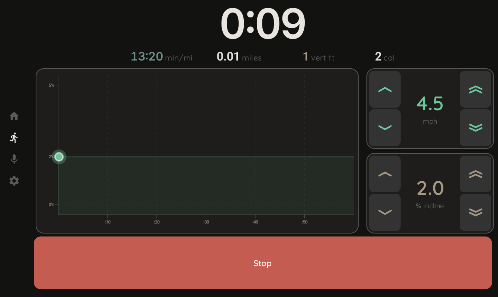
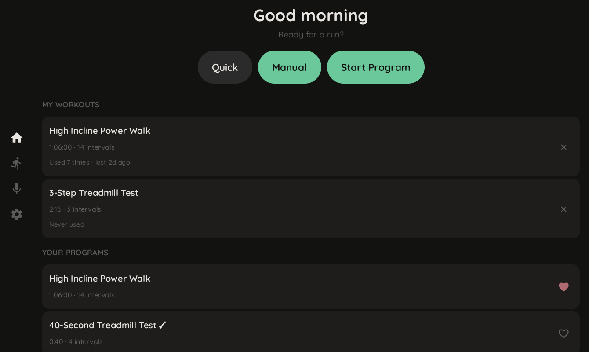

# Precor 9.3x — AI Treadmill

> A 2005 treadmill that listens when you talk to it.

A Raspberry Pi sits between the console and motor controller of a Precor 9.31 treadmill, intercepting the serial bus. It runs an AI coach (Gemini), voice control, a tablet UI, and a Bluetooth daemon that makes Zwift think it's a modern smart treadmill.

---

## Voice + AI Coach



- "Set speed to 5" or "give me a 20-minute hill workout" — Gemini controls the belt directly
- Voice works mid-run via Gemini Live (real-time, no wake word)
- Says "this is the hardest interval" or "you're faster than last time" because it can query your run history

## Apps



- **Android** (Kotlin + Compose): runs on a tablet mounted on the treadmill console
- **Web** (React + TypeScript): same features, any browser
- Workout library, run history, live elevation profile, calorie tracking

## Bluetooth

- Rust daemon makes the treadmill show up in Zwift, Peloton, QZ Fitness, and Apple Watch as a standard FTMS device
- Fitness apps can read speed/incline and write speed/incline commands back

## Heart Rate

- Connects to any Bluetooth heart rate strap
- HR shows in the UI and feeds into calorie calculations

---

## Architecture

```
┌─────────────────────────────────────────────────────────┐
│   Web UI (React + Vite)  │  Android (Kotlin + Compose)  │
├──────────────────────────┴──────────────────────────────┤
│  REST / WebSocket / Gemini Live (voice)                 │
├─────────────────────────────────────────────────────────┤
│                  server.py (FastAPI)                     │
│   Sessions, programs, AI chat, workout query DB          │
│   workout_session.py │ program_engine.py │ workout_db.py │
├──────────────────────┼───────────────────┼──────────────┤
│  treadmill_client.py │  hrm_client.py   │              │
│  (Unix socket IPC)   │  (Unix socket)   │              │
├──────────────────────┴───────────────────┴──────────────┤
│  treadmill_io (C++20)  │  ftms-daemon   │  hrm-daemon  │
│  GPIO serial, safety   │  (Rust, BLE)   │  (Rust, BLE) │
│  proxy/emulate modes   │  FTMS service  │  HR client   │
└─────────────────────────┴──────────────────┴────────────┘
                          │
                    Precor 9.31
                  RS-485 serial bus
```

- **C++ binary** — reads/writes the serial bus, enforces safety (3-hour timeout, physical buttons always override software)
- **Python server** — FastAPI. All the logic: Gemini AI, workouts, sessions, run history
- **FTMS daemon** — Rust. Bluetooth for fitness apps
- **HRM daemon** — Rust. Connects to heart rate straps
- **Web + Android** — display layers. All decisions happen server-side.

Details: [CLAUDE.md](CLAUDE.md)

---

## The Hardware Story

> The serial protocol turned out to be plain ASCII text. We just had the polarity wrong and spent days decoding "binary" that was actually `[key:value]` pairs with every bit flipped.

[Full reverse engineering writeup →](HARDWARE.md)

---

## Quick Start

**Prerequisites (Pi):** `libpigpio-dev`, `g++`, Python 3 with `google-genai`, `fastapi`, `uvicorn`, `gpxpy`. Gemini API key in `.gemini_key`.

```bash
make                         # build C++ binary
sudo ./build/treadmill_io    # start GPIO daemon (must be root)
python3 python/server.py     # start web server → https://<pi>:8000
```

**Deploy to Pi:**
```bash
make deploy    # stages, rsyncs, builds on Pi, restarts all 4 services
```

**Local dev (no Pi needed):**
```bash
TREADMILL_MOCK=1 ./scripts/dev.sh    # Caddy + server + Vite HMR
```

API reference, tests, and dev docs: [CLAUDE.md](CLAUDE.md)

## License

MIT
